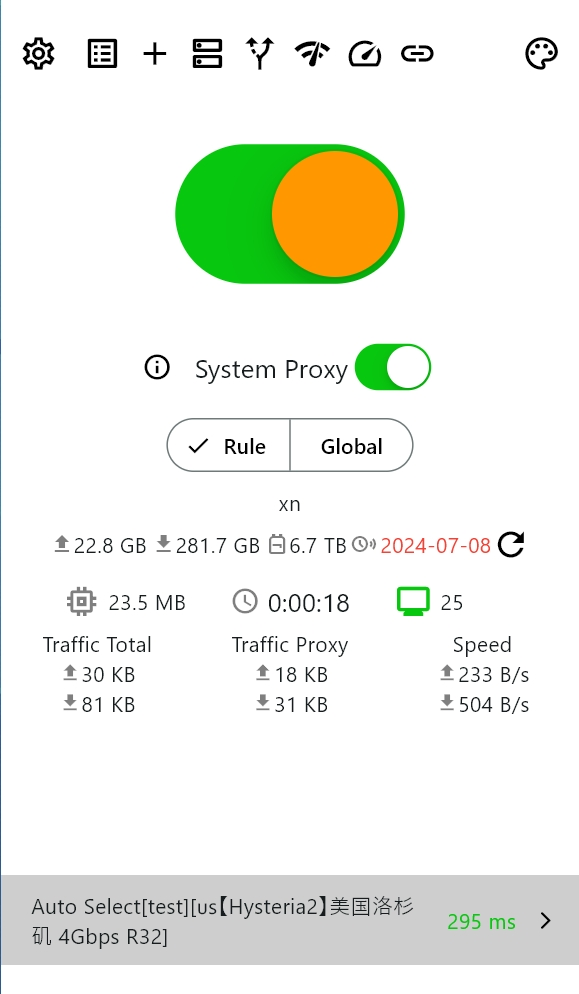
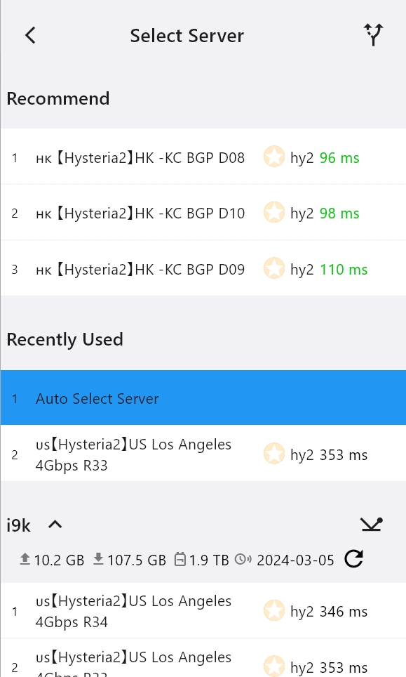
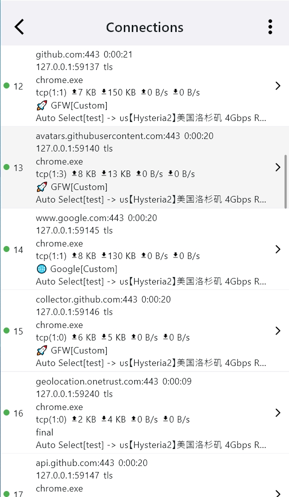
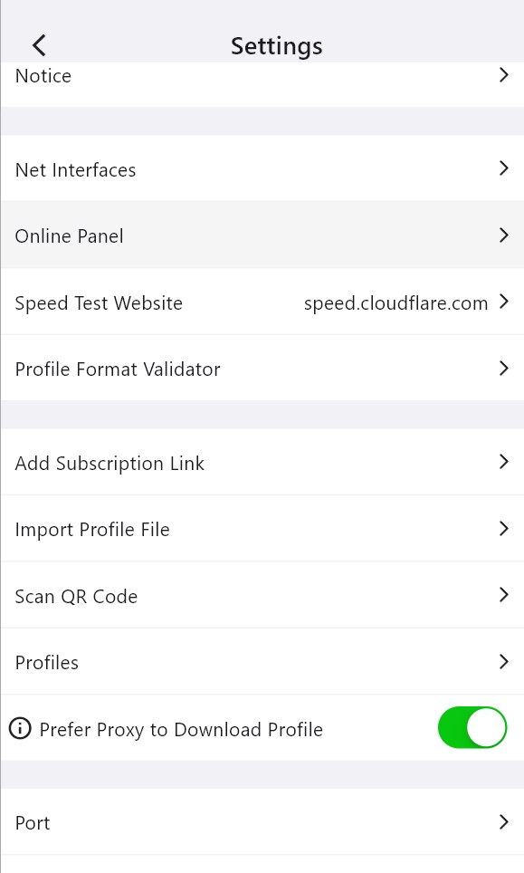
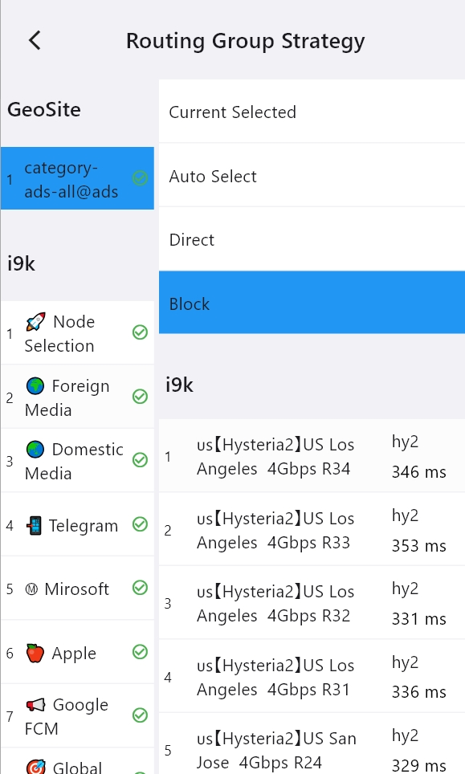
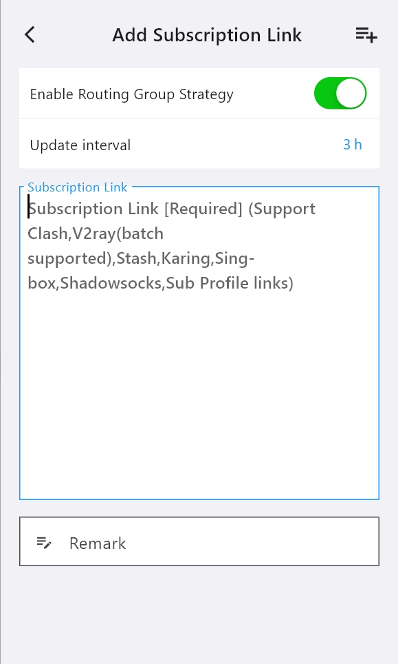

<h1 align="center">
  
   
  Karing - Simple & Powerful proxy utility
   
</h1>

<h3 align="center">
A <a href="https://github.com/SagerNet/sing-box">singbox</a> GUI based on <a href="https://github.com/flutter/flutter">flutter</a>.
</h3>

English | [Chinese](./README_cn.md) | [Russian](./README_ru.md) | [Persian](./README_fa.md)

## Features
- Compatible with Clash, V2ray/V2fly, Sing-box, Shadowsocks, Sub, Github Subscriptions.
  - Full `clash` config supported, Partial `clash.meta` config supported.

- A set of routing rules applied to multiple subscription sources automatically selects efficient nodes.
- Supports custom routing rule groups and node groups.
  - Customizes default routing rule groups for novice users - ready to use right out of the box.
  - Built-in geo-IP, geo-site, ACL, and [other rulesets](https://github.com/KaringX/karing-ruleset/)

- Backup and synchronization, synchronizing multiple devices with a single configuration.
  - Supports synchronization within the local area network.
  - Supports WebDAV.
  - Supports importing/exporting ZIP files.

- Built-in support for [the modified sing-box core](https://github.com/KaringX/sing-box).
- Introduces a beginner mode for simpler configuration.
- Plan to support all platforms.

## Promotion

View all promotions

### 推荐机场
[狗狗加速 —— 技术流机场 Doggygo VPN](https://panel.dg6.top/#/register?code=lFH4ii9D)

- 高性能海外机场，海外团队，无跑路风险
- 专属链接注册送 3 天，每天 1G 流量免费试用: [狗狗加速.com](https://panel.dg6.top/#/register?code=lFH4ii9D)
- 优惠套餐每月仅需 15.8 元，160G 流量，年付 8 折
- 全球首家支持`Hysteria2` 协议，集群负载均衡设计，高速专线，极低延迟，无视晚高峰，4K 秒开
- 解锁流媒体及 ChatGPT

[跟斗云 —— 小众首选](https://跟斗云.com/auth/register?code=71be1e9a1a)

- 高性能机场, 主推Tuic(v5) 更快更稳定。
- 免费试用链接: [NovaCloud](https://跟斗云.com/auth/register?code=71be1e9a1a)
- karing team 自用良好

[NETZ —— ISP in Russia](https://netz.run)

- High-performance overseas VPN, free trial, support trojan protocol.
- Free trial and purchase (no registration required)：[Telegram bot](https://t.me/netzrun_bot?start=ref_karing)

### 🔥自建节点服务器
- （美国免备案vps，配置2核2G仅需`20.98$`≈`145RMB`一年/支持支付宝付款） [👉🏻点我直达](https://my.racknerd.com/aff.php?aff=8405)
- （美国到中国大陆最快的vps， CN2GIA优化网络）
  - [👉🏻国外直达](https://bandwagonhost.com/aff.php?aff=75253&productFilter=1)
  - [👉🏻国内点我](https://bwh81.net/aff.php?aff=75253&productFilter=1)

### 🤝VPN Providers Collaboration Announcement
- 👉[Contact information and forms of cooperation](https://karing.app/blog/isp/cooperation#for-vpn-providers-from-other-regions)👈

## System Requirements(64-bit only)
- Windows >= 10
- Android >= 8
- IOS >= 15
- MacOS >= 12

## Install
- **Windows/Android**:
  - https://github.com/KaringX/karing/releases/latest
- **IOS/MacOS TestFlight**:
  - https://testflight.apple.com/join/RLU59OsJ
- **IOS/MacOS AppStore**: (Search Keywords: karing vpn)
  - https://apps.apple.com/us/app/karing/id6472431552

### FAQ

> wating...

## Todos
- Platform to be supported:
  - tvOS（apple tv）
  - linux | [linglong](https://linglong.dev/)
- Globalization(multi-language)
  - If you are willing to work with us to support Karing globalization, please contact us [Telegram](https://t.me/ovowe)

## Screenshots (Windows version)

  
    
  
      
  
    
  
    
  
    
  

## Contributions
[welcome to report issue!](https://github.com/KaringX/karing/issues)

## Donate

## Acknowledgement

Karing was based on or inspired by these projects and so on:

- [flutter](https://flutter.dev/): makes it easy and fast to build beautiful apps for mobile and beyond.
- [singbox](https://sing-box.sagernet.org/): The universal proxy platform.
- [Meta-Docs](https://wiki.metacubex.one/config/): Clash.Meta docs

## Star History

