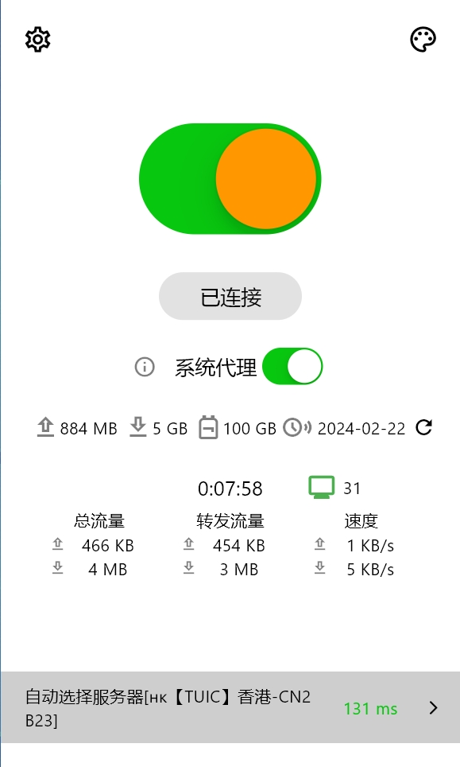
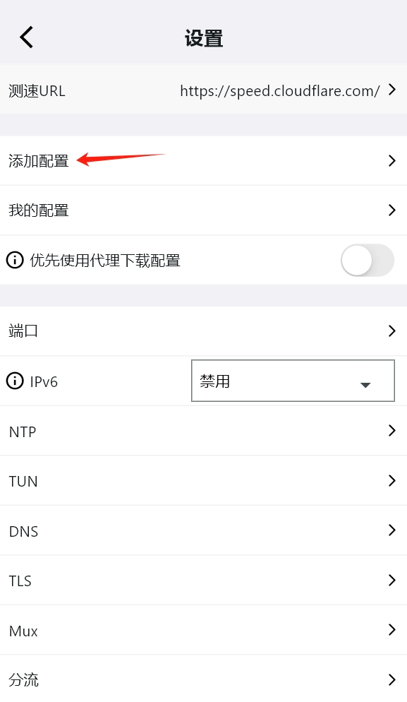
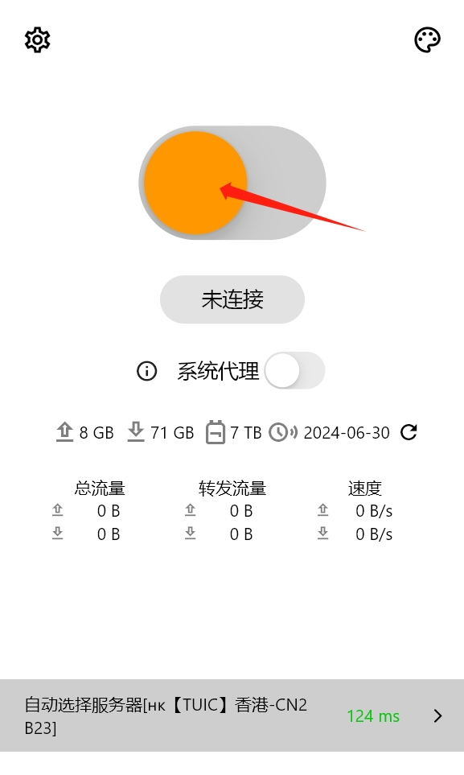
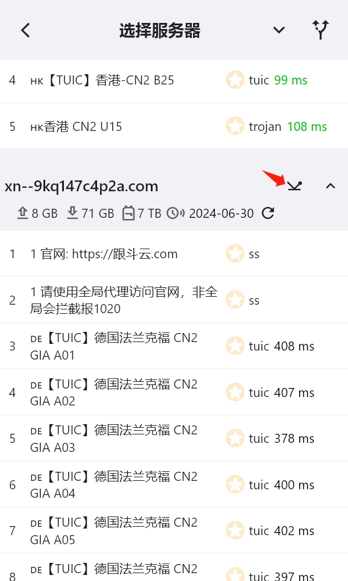
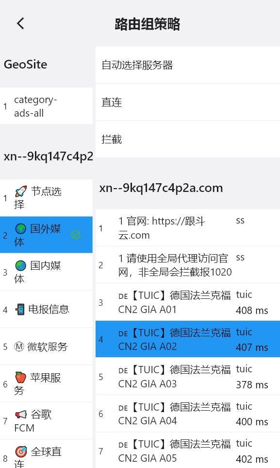
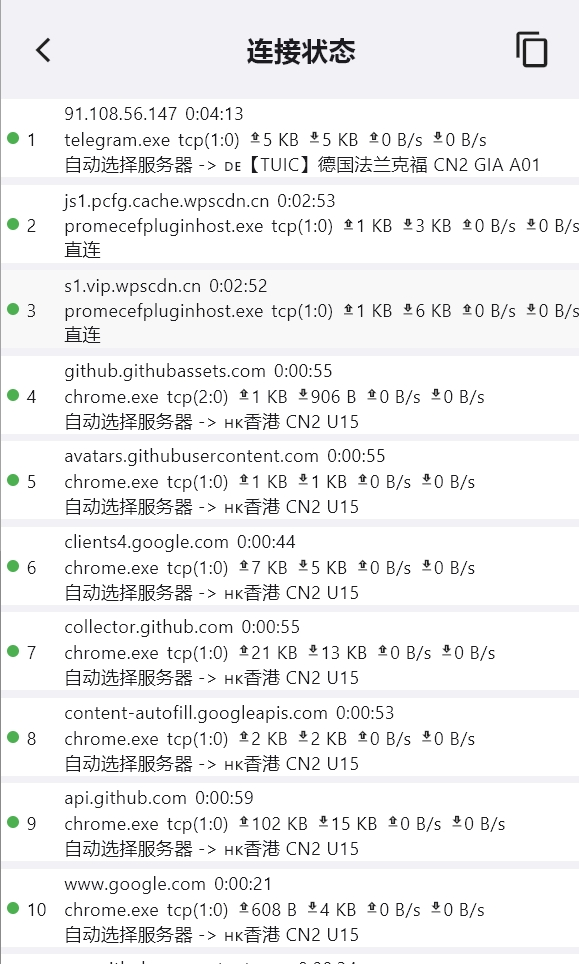

<h1 align="center">
  
   
  Karing - Simple & Powerful proxy utility
   
</h1>

<h3 align="center">
A <a href="https://github.com/SagerNet/sing-box">sing-box</a> GUI based on <a href="https://github.com/flutter/flutter">flutter</a>.
</h3>

## Features
- Compatible with Clash, V2ray/V2fly, Sing-box, SS Subscriptions.
- Full `clash` config supported, Partial `clash.meta` config supported.
- Simple UI and supports custom theme color.
- Built-in support [sing-box](https://github.com/SagerNet/sing-box) core.
- System proxy setting and guard.
- Plan to support all platforms.

## Promotion

[跟斗云 —— 技术流机场 NovaCloud](https://xn--9kq147c4p2a.com/auth/register?code=71be1e9a1a)

- High-performance overseas VPN, free trial, support Hysteria2 and TUIC v5 protocol.
- 高性能海外机场，免费试用，完美匹配sing-box客户端，支持主流QUIC协议
  - Hysteria2
  - TUIC v5
- 使用 Karing 专属邀请链接注册送免费流量，试用链接：https://xn--9kq147c4p2a.com/auth/register?code=71be1e9a1a

Promotion Detail

- Karing 小圈子**自用**【推荐】

 

## Install
- **Windows**:
  - https://github.com/KaringX/karing/releases/latest
- **IOS TestFlight**:
  - https://testflight.apple.com/join/RLU59OsJ

### FAQ

> wating...

## Todos
- Platform to be supported:
  - macOS
  - tvOS（apple tv）
  - android
  - linux | [玲珑](https://linglong.dev/)

## Screenshots

  
  

  
   
  
  
   
  
  

## Contributions
[welcome to report issue!](https://github.com/KaringX/karing/issues)

## Acknowledgement

Karing was based on or inspired by these projects and so on:

- [flutter](https://flutter.dev/): makes it easy and fast to build beautiful apps for mobile and beyond.
- [sing-box](https://sing-box.sagernet.org/): The universal proxy platform.
- [Meta-Docs](https://wiki.metacubex.one/config/): Clash.Meta docs
