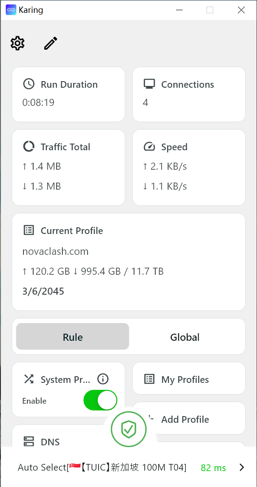
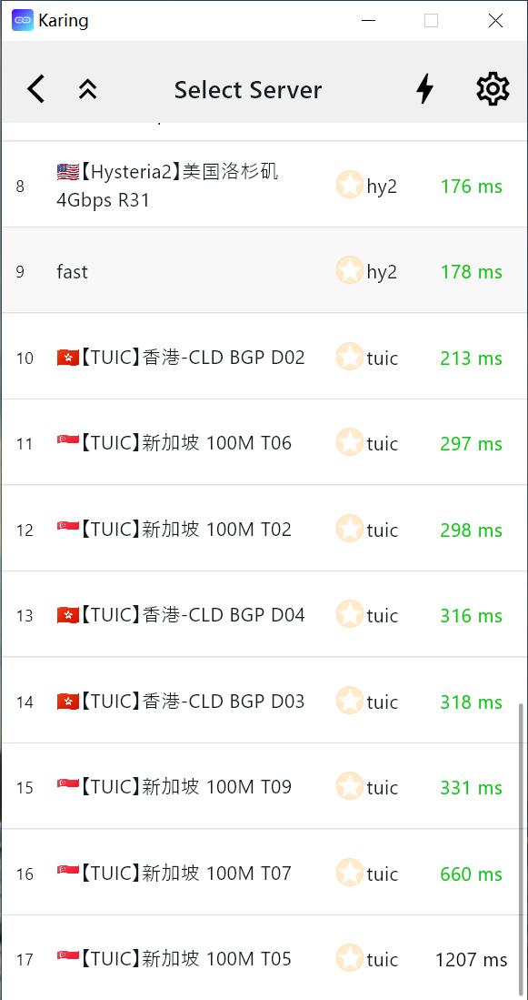
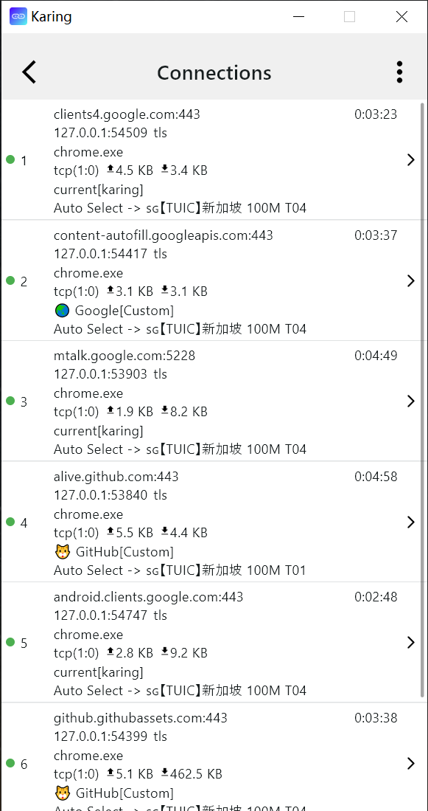
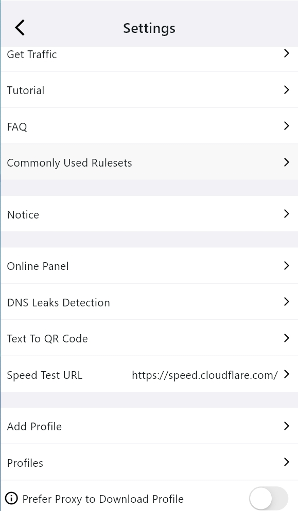
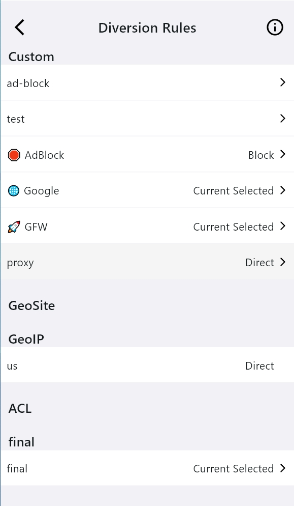
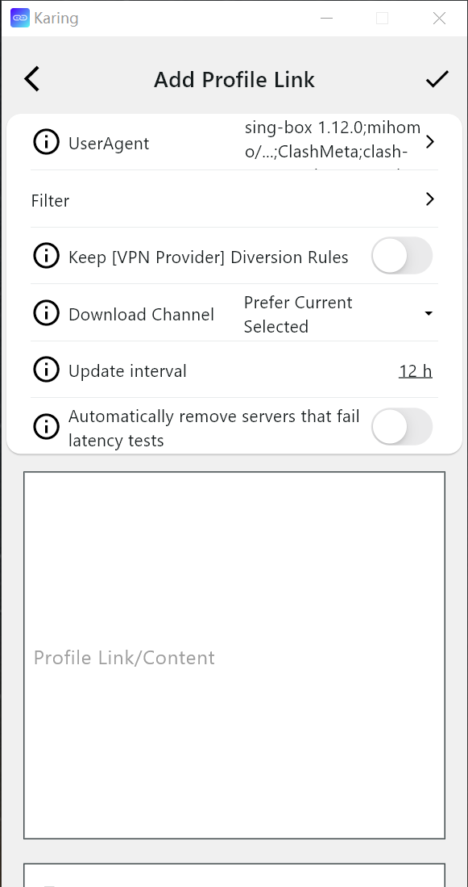

<h1 align="center">
  
   
  Karing - ابزار پراکسی ساده و قدرتمند
   
</h1>

<h3 align="center">
واسط گرافیکی <a href="https://github.com/SagerNet/sing-box">singbox</a> بر اساس <a href="https://github.com/flutter/flutter">flutter</a>.
</h3>

[انگلیسی](./README.md) | [چینی](./README_cn.md) | [روسی](./README_ru.md) | فارسی
### توجه: Karing هیچ کانالی در مورد Karing در هیچ پلتفرم ویدیویی باز نکرده است.
## ویژگی‌ها
- سازگار با Clash، V2ray/V2fly، Sing-box، Shadowsocks، Sub و Github Subscriptions.
- پشتیبانی کامل از تنظیمات `clash`، پشتیبانی جزئی از تنظیمات `clash.meta`.
- رابط کاربری ساده و پشتیبانی از رنگ تم سفارشی.
- پشتیبانی داخلی از هسته [singbox](https://github.com/SagerNet/sing-box).
- تنظیمات پروکسی سیستمی و نگهبان.
- قصد پشتیبانی از تمامی پلتفرم‌ها.

## Promotion

recommend

### VPN Providers Collaboration Announcement

- [List of other ISPs](https://1.x31415926.top/ir.html)

- 👉[Contact information and forms of cooperation](https://karing.app/blog/isp/cooperation#for-vpn-providers-from-other-regions)👈

## نیازمندی‌های سیستم (تنها 64 بیت)
- Windows >= 10 (64bits only)
- Android >= 8 (arm64-v8a, armeabi-v7a)
- Linux >= 10 (64bits only)
- IOS >= 15
- MacOS >= 12 (Intel, Apple Silicon)
- TvOS >= 17

## نصب
- **IOS/TvOS AppStore**: (جستجو با کلمات کلیدی: karing vpn)
  - https://apps.apple.com/us/app/karing/id6472431552
- **IOS/TvOS TestFlight**:
  - https://testflight.apple.com/join/RLU59OsJ
- **Android**:
  - [https://karing.app/download](https://karing.app/download)
  - https://github.com/KaringX/karing/releases/latest
  - APKPure https://apkpure.com/p/com.nebula.karing
  - Amazon AppStore https://www.amazon.com/gp/product/B0DJSQDDM8

- **Windows/Macos/Linux**:
  - [https://karing.app/download](https://karing.app/download)
  - https://github.com/KaringX/karing/releases/latest

### سوالات متداول

> [FAQ|en](https://karing.app/en/faq/)

## کارهای باقی‌مانده
- پلتفرم‌هایی که قرار است پشتیبانی شوند:
- جهانی‌سازی (چندزبانه)
  - اگر مایل به همکاری برای پشتیبانی از جهانی‌سازی Karing هستید، لطفاً ایمیل به bdluking@gmail.com ارسال کنید

## تصاویر (نسخه ویندوز)

  
    
  
      
  
    
  
    
  
    
  

## همکاری‌ها
[خوشحال می‌شویم اگر مشکلی گزارش دهید!](https://github.com/KaringX/karing/issues)

## Donate

## قدردانی

Karing بر اساس یا الهام‌گیری شده از این پروژه‌ها و غیره بوده است:

- [فلاتر](https://flutter.dev/): امکان ساخت برنامه‌های زیبا برای موبایل و موارد دیگر را ساده و سریع می‌کند.
- [singbox](https://sing-box.sagernet.org/): پلتفرم یکپارچه پروکسی.
- [Meta-Docs](https://wiki.metacubex.one/config/): اسناد Clash.Meta

### Karing Team:
- [Karing](https://karing.app): https://karing.app
- [Clash Mi](https://clashmi.app/): https://clashmi.app/
- [sing-poet](https://github.com/KaringX/sing-poet)

