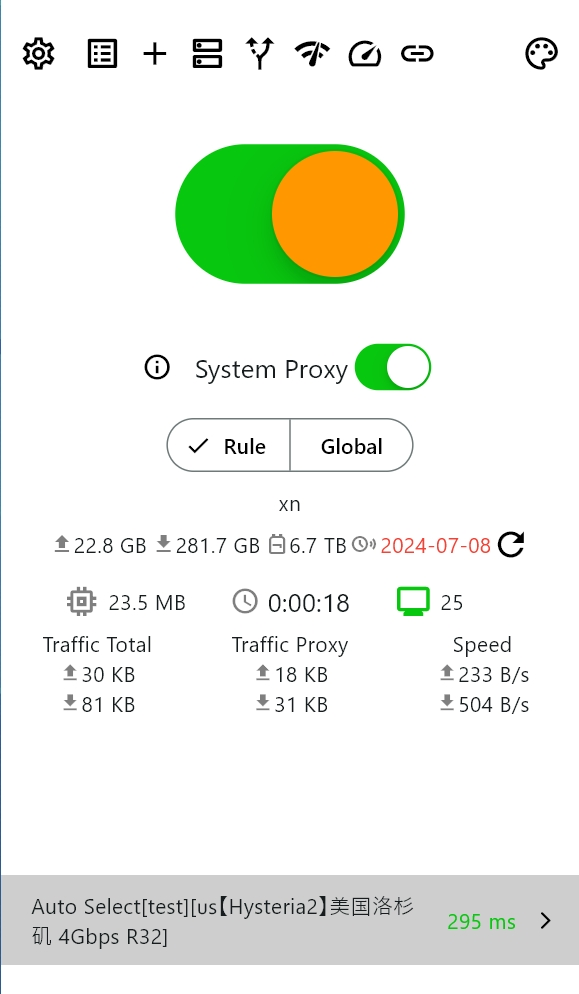
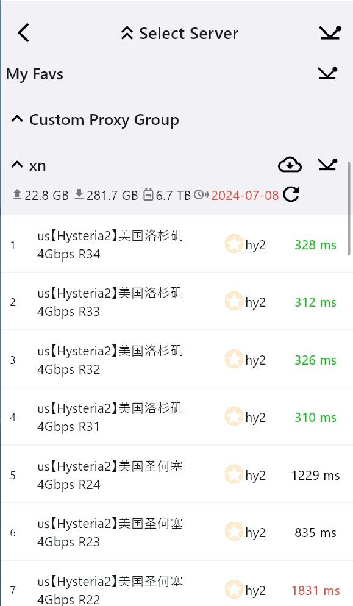
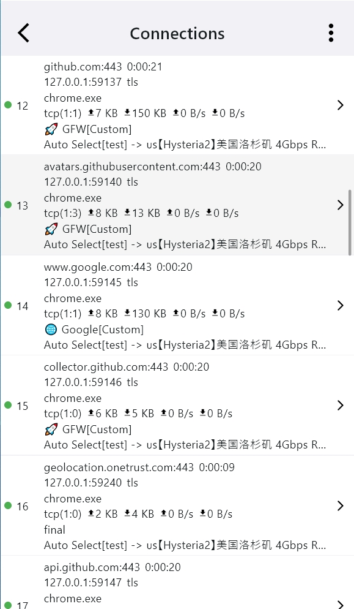
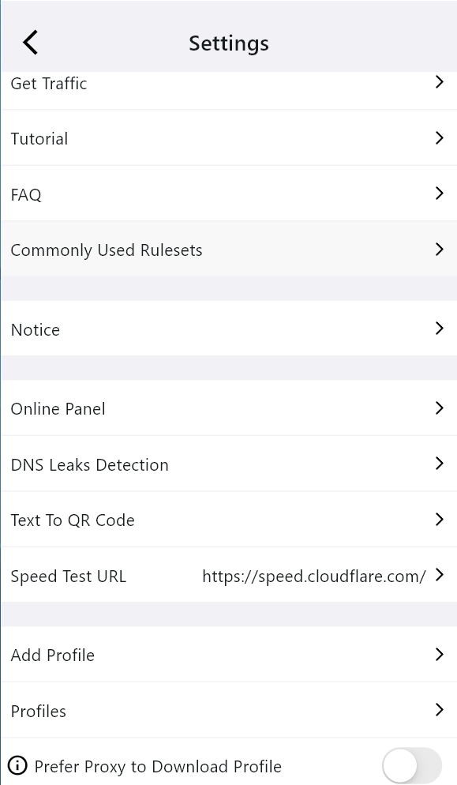
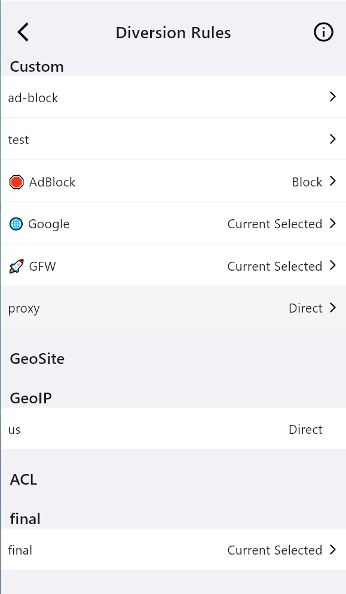
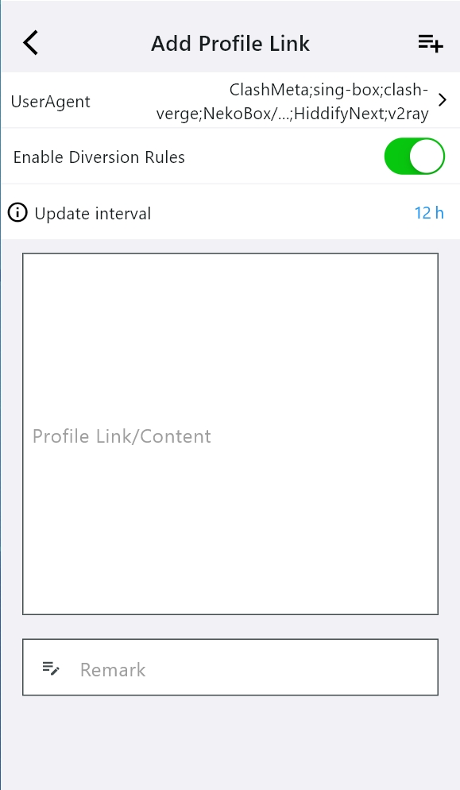

<h1 align="center">
  
   
  Karing — Простая и мощная прокси-утилита
   
</h1>

<h3 align="center">
Графический интерфейс (GUI) для <a href="https://github.com/SagerNet/sing-box">singbox</a> на базе <a href="https://github.com/flutter/flutter">flutter</a>.
</h3>

[English](./README.md) | [简体中文](./README_cn.md) | [繁體中文](./README_tw.md) | [日本語](./README_ja.md) | [한국어](./README_ko.md) | [Español](./README_es.md) | [Français](./README_fr.md) | [Deutsch](./README_de.md) | [Italiano](./README_it.md) | [Tiếng Việt](./README_vi.md) | [Türkçe](./README_tr.md) | Русский | [فارسی](./README_fa.md) | [العربية](./README_ar.md) | [Português](./README_pt.md) | [Português (BR)](./README_pt_BR.md) | [Українська](./README_uk.md) | [Polski](./README_pl.md) | [اردو](./README_ur.md) | [Svenska](./README_sv.md) | [Norsk](./README_no.md) | [Nederlands](./README_nl.md) | [हिन्दी](./README_hi.md) | [Ελληνικά](./README_el.md) | [Dansk](./README_da.md) | [বাংলা](./README_bn.md) | [ไทย](./README_th.md) | [ਪੰਜਾਬੀ](./README_pa.md)

### Примечание: У Karing нет официальных каналов ни на одной видеоплатформе

## Возможности
- Совместимость с подписками Clash, V2ray/V2fly, Sing-box, Shadowsocks, Sub, GitHub Subscriptions.
  - Полная поддержка конфигурации `clash`, частичная поддержка `clash.meta`.

- Единый набор правил маршрутизации применяется к нескольким источникам подписок и автоматически выбирает наиболее эффективные узлы.
- Поддержка пользовательских групп правил маршрутизации и групп узлов.
  - Готовые группы правил маршрутизации по умолчанию для новичков — работает сразу после установки.
  - Встроенные geo-IP, geo-site, ACL и [другие наборы правил](https://github.com/KaringX/karing-ruleset/).

- Резервное копирование и синхронизация нескольких устройств с помощью одной конфигурации.
  - Поддержка синхронизации через iCloud [iOS/macOS].
  - Поддержка синхронизации в локальной сети (LAN).
  - Поддержка WebDAV.
  - Поддержка импорта и экспорта ZIP-файлов.

- Встроенная поддержка [модифицированного ядра sing-box](https://github.com/KaringX/sing-box).
- Наличие режима для новичков для более простой настройки.
- Планируется поддержка дополнительных платформ.

## Реклама

Посмотреть всю рекламу

### Рекомендуемые VPN-сервисы

[狗狗加速 —— Технологичный VPN Doggygo](https://2.x31415926.top/redir.html?url=aHR0cHM6Ly93d3cuZGc2LnRvcC8jL3JlZ2lzdGVyP2NvZGU9bEZINGlpOUQ=&i=3eb&t=1723644053)

- Высокопроизводительный зарубежный сервис, зарубежная команда, без риска закрытия
- При регистрации по специальной ссылке дается 3 дня и по 1 ГБ трафика в день для [бесплатного тестирования](https://2.x31415926.top/redir.html?url=aHR0cHM6Ly93d3cuZGc2LnRvcC8jL3JlZ2lzdGVyP2NvZGU9bEZINGlpOUQ=&i=3eb&t=1723644053)
- Выгодные тарифы всего от 15.8 юаней/мес за 160 ГБ трафика, скидка 20% при оплате за год
- Первым в мире поддержал протокол `Hysteria2`, кластерная балансировка нагрузки, высокоскоростные выделенные линии, сверхнизкая задержка, стабильная работа в вечерние часы пик, мгновенное воспроизведение 4K
- Разблокировка стриминговых сервисов и ChatGPT

[👉 Ещё больше скидок на VPN-сервисы (обновляется ежедневно)](https://2.x31415926.top/)

### 🤝 Объявление о сотрудничестве для VPN-провайдеров
- 👉 [Контактная информация и форматы сотрудничества](https://karing.app/blog/isp/cooperation#for-vpn-providers-from-other-regions) 👈

## Системные требования
- Windows >= 10 (только 64-бит)
- Android >= 8 (arm64-v8a, armeabi-v7a)
- Linux (только 64-бит, glibc >= 2.38 для текущих .deb пакетов)
- iOS >= 15
- macOS >= 12 (Intel, Apple Silicon)
- tvOS >= 17

## Установка
- **iOS/tvOS AppStore**: (Ключевые слова для поиска: karing vpn)
  - https://apps.apple.com/us/app/karing/id6472431552
- **iOS/tvOS TestFlight**:
  - https://testflight.apple.com/join/RLU59OsJ
- **Android**:
  - [https://karing.app/download](https://karing.app/download)
  - https://github.com/KaringX/karing/releases/latest
  - APKPure https://apkpure.com/p/com.nebula.karing
  - Amazon AppStore https://www.amazon.com/gp/product/B0DJSQDDM8
- **Windows/macOS/Linux**:
  - [https://karing.app/download](https://karing.app/download)
  - https://github.com/KaringX/karing/releases/latest
  - `brew install karing`

### Часто задаваемые вопросы (FAQ)

> [FAQ | en](https://karing.app/en/faq/)

## Скриншоты

  
    
  
      
  
    
  
    
  
    
  

## Участие в разработке
[Будем рады вашим отчётам об ошибках!](https://github.com/KaringX/karing/issues)

## Поддержать проект

## Проекты
### Благодарности: Проект Karing основан на следующих проектах или вдохновлён ими:

- [flutter](https://flutter.dev/): позволяет легко и быстро создавать красивые приложения для мобильных и других платформ.
- [singbox](https://sing-box.sagernet.org/): универсальная прокси-платформа.
- [Meta-Docs](https://wiki.metacubex.one/config/): документация Clash.Meta.

### Команда Karing:
- [Karing](https://karing.app): https://karing.app
- [Clash Mi](https://clashmi.app/): https://clashmi.app/
- [sing-poet](https://github.com/KaringX/sing-poet)

## История звёзд (Star History)

