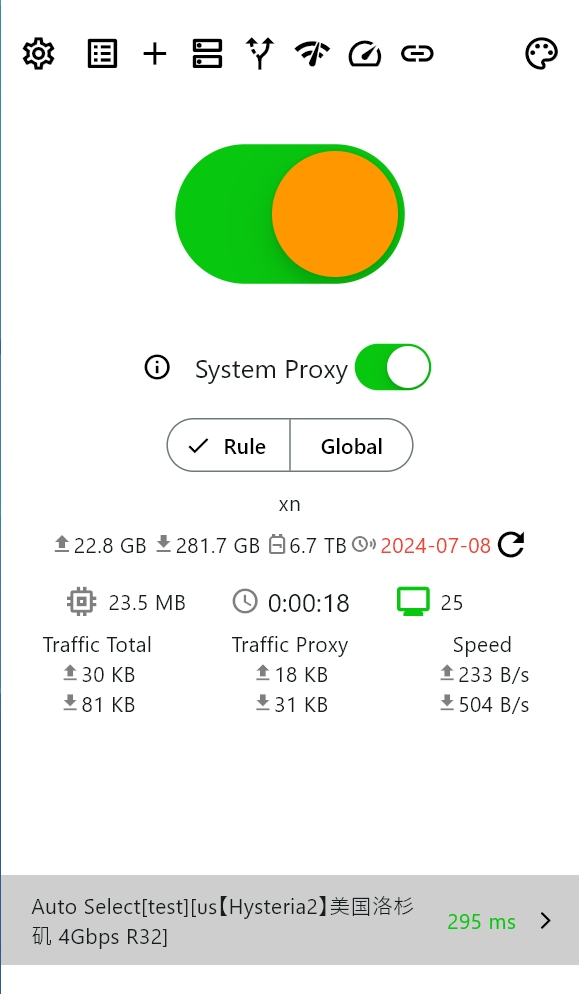
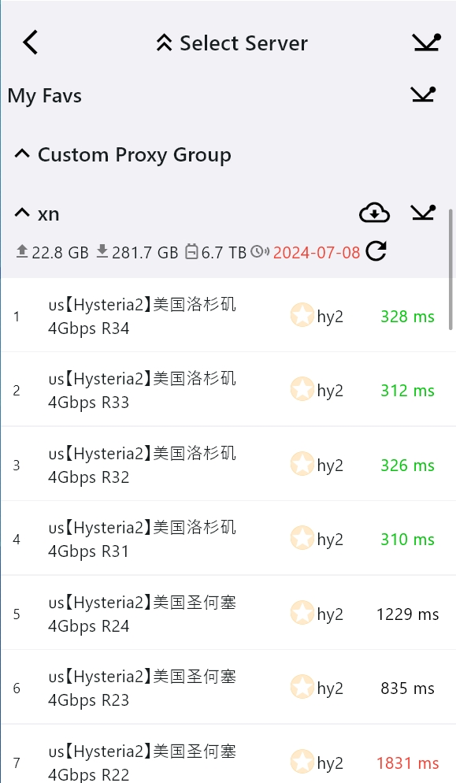
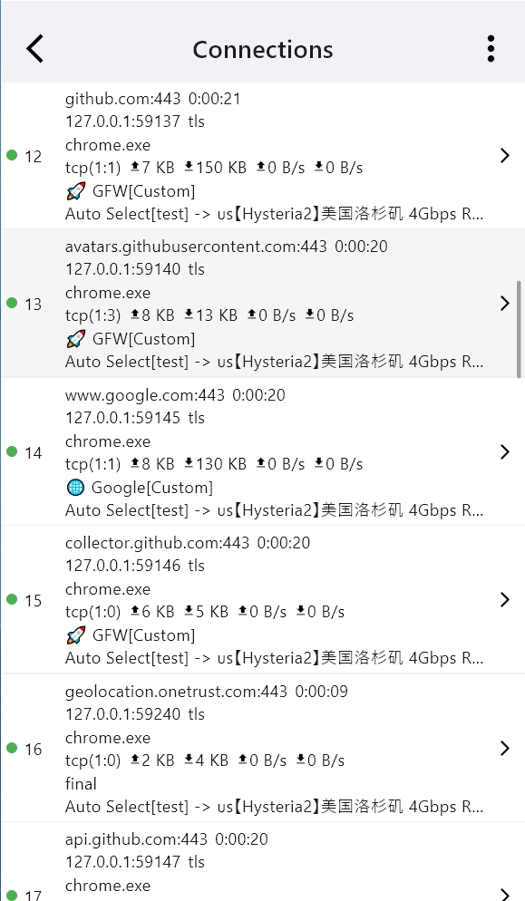
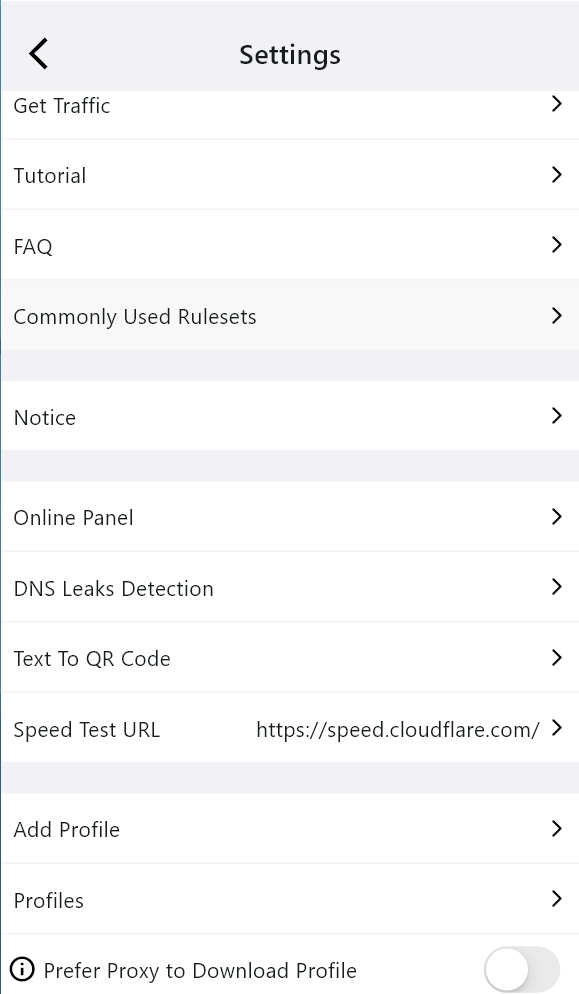
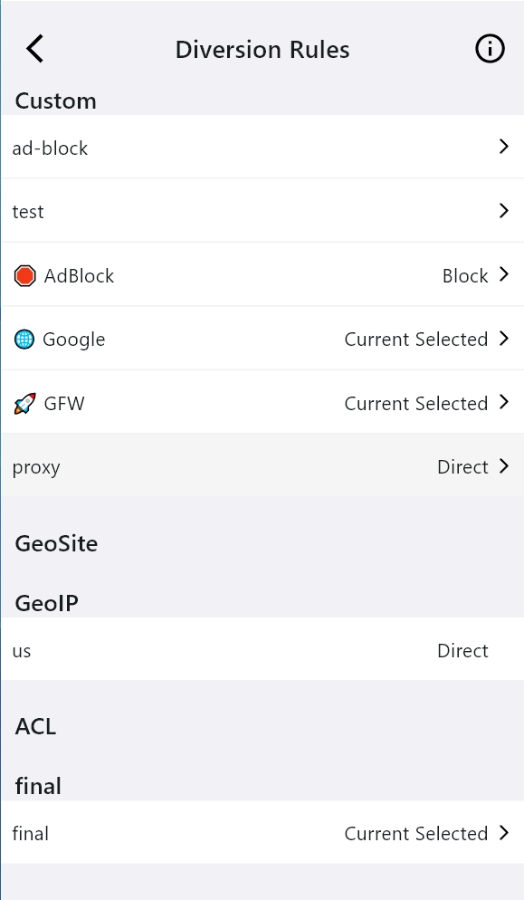
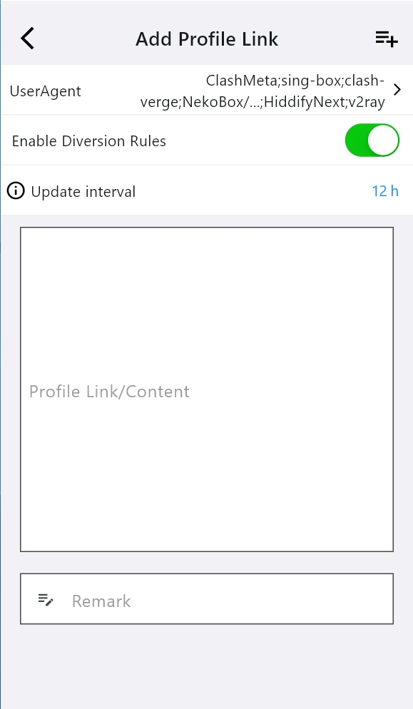

<h1 align="center">
  
   
  Karing - Enkelt och kraftfullt proxyverktyg
   
</h1>

<h3 align="center">
En <a href="https://github.com/SagerNet/sing-box">singbox</a>-GUI baserad på <a href="https://github.com/flutter/flutter">flutter</a>.
</h3>

[English](./README.md) | [简体中文](./README_cn.md) | [繁體中文](./README_tw.md) | [日本語](./README_ja.md) | [한국어](./README_ko.md) | [Español](./README_es.md) | [Français](./README_fr.md) | [Deutsch](./README_de.md) | [Italiano](./README_it.md) | [Tiếng Việt](./README_vi.md) | [Türkçe](./README_tr.md) | [Русский](./README_ru.md) | [فارسی](./README_fa.md) | [العربية](./README_ar.md) | [Português](./README_pt.md) | [Українська](./README_uk.md) | [Polski](./README_pl.md) | [اردو](./README_ur.md) | Svenska | [Norsk](./README_no.md) | [Nederlands](./README_nl.md) | [हिन्दी](./README_hi.md) | [Ελληνικά](./README_el.md) | [Dansk](./README_da.md) | [বাংলা](./README_bn.md) | [ไทย](./README_th.md) | [ਪੰਜਾਬੀ](./README_pa.md)

### Notera: Karing har inte öppnat någon kanal relaterad till Karing på någon videoplattform.

## Funktioner
- Kompatibel med prenumerationer från Clash, V2ray/V2fly, Sing-box, Shadowsocks, Sub, Github.
  - Fullt stöd för `clash`-konfiguration, delvis stöd för `clash.meta`-konfiguration.

- En uppsättning routingregler som tillämpas på flera prenumerationskällor väljer automatiskt effektiva noder.
- Stöd för anpassade routingregelgrupper och nodgrupper.
  - Anpassar standardroutingregelgrupper för nybörjare - redo att användas direkt.
  - Inbyggd geo-IP, geo-site, ACL och [andra regeluppsättningar](https://github.com/KaringX/karing-ruleset/).

- Säkerhetskopiering och synkronisering, synkronisera flera enheter med en enda konfiguration.
  - Stöder iCloud-synkronisering [IOS/MacOS].
  - Stöder synkronisering inom det lokala nätverket.
  - Stöder WebDAV.
  - Stöder import/export av ZIP-filer.

- Inbyggt stöd för den [modifierade sing-box-kärnan](https://github.com/KaringX/sing-box).
- Introducerar ett nybörjarläge för enklare konfiguration.
- Planerar att stödja fler plattformar.

## Kampanjer

Visa alla kampanjer

### Rekommenderad VPN

[Doggygo VPN —— Acceleration för experter](https://1.x31415926.top/redir.html?url=aHR0cHM6Ly93d3cuZGc2LnRvcC8jL3JlZ2lzdGVyP2NvZGU9bEZINGlpOUQ=&i=3eb&t=1723644053)

- Högpresterande utländsk leverantör (Airport), internationellt team, ingen risk för stängning.
- Registrering via exklusiv länk ger 3 dagar och 1G daglig trafik [Gratis provperiod](https://1.x31415926.top/redir.html?url=aHR0cHM6Ly93d3cuZGc2LnRvcC8jL3JlZ2lzdGVyP2NvZGU9bEZINGlpOUQ=&i=3eb&t=1723644053).
- Rabatterade paket från endast 15,8 yuan per månad, 160G trafik, 20% rabatt vid årsbetalning.
- Först i världen med stöd för `Hysteria2`-protokollet, klusterlastbalansering, höghastighets dedikerad linje, extremt låg latens, ignorerar nattliga toppar, 4K direkt.
- Låser upp streamingmedia och ChatGPT.

[👉 Fler erbjudanden uppdateras dagligen](https://1.x31415926.top/)

### 🤝 Samarbetsmeddelande för VPN-leverantörer
- 👉 [Kontaktinformation och samarbetsformer](https://karing.app/blog/isp/cooperation#for-vpn-providers-from-other-regions) 👈

## Systemkrav
- Windows >= 10 (endast 64-bit)
- Android >= 8 (arm64-v8a, armeabi-v7a)
- Linux (endast 64-bit)
- IOS >= 15
- MacOS >= 12 (Intel, Apple Silicon)
- TvOS >= 17

## Installation
- **IOS/TvOS AppStore**: (Sökord: karing vpn)
  - https://apps.apple.com/us/app/karing/id6472431552
- **IOS/TvOS TestFlight**:
  - https://testflight.apple.com/join/RLU59OsJ
- **Android**:
  - [https://karing.app/download](https://karing.app/download)
  - https://github.com/KaringX/karing/releases/latest
  - APKPure https://apkpure.com/p/com.nebula.karing
  - Amazon AppStore https://www.amazon.com/gp/product/B0DJSQDDM8
- **Windows/Macos/Linux**:
  - [https://karing.app/download](https://karing.app/download)
  - https://github.com/KaringX/karing/releases/latest
  - `brew install karing`

### FAQ (Vanliga frågor)

> [FAQ|sv](https://karing.app/en/faq/)

## Skärmdumpar

  
    
  
      
  
    
  
    
  
    
  

## Bidrag
[Välkommen att rapportera problem!](https://github.com/KaringX/karing/issues)

## Donera

## Projekt
### Tack till: Karing baserades på eller inspirerades av dessa projekt:

- [flutter](https://flutter.dev/): gör det enkelt och snabbt att bygga vackra appar för mobilen och mer.
- [singbox](https://sing-box.sagernet.org/): Den universella proxyplattformen.
- [Meta-Docs](https://wiki.metacubex.one/config/): Clash.Meta-dokumentation

### Karing-teamet:
- [Karing](https://karing.app): https://karing.app
- [Clash Mi](https://clashmi.app/): https://clashmi.app/
- [sing-poet](https://github.com/KaringX/sing-poet)

## Star History

